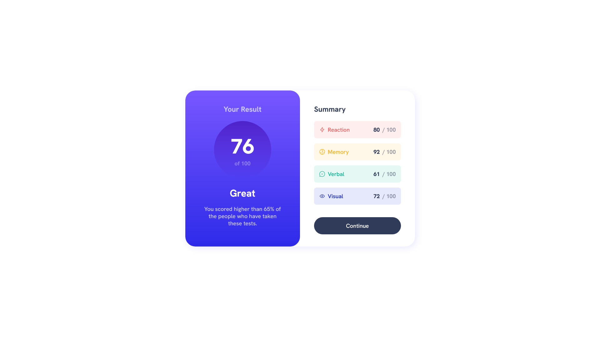

# Frontend Mentor - Results summary component solution

This is a solution to the [Results summary component challenge on Frontend Mentor](https://www.frontendmentor.io/challenges/results-summary-component-CE_K6s0maV). *insert "this video is sponsored by frontend mentor" segment here*

## Table of contents

- [Overview](#overview)
  - [Screenshot](#screenshot)
  - [Links](#links)
- [My process](#my-process)
  - [Built with](#built-with)
  - [What I learned](#what-i-learned)
- [Author](#author)

## Overview

i was too lazy to calculate the final score with js, but not lazy enough to read data.json

### Screenshot

### Links

- Solution URL: [https://github.com/TypicalTeacup/fe-mentor-results-summary](https://github.com/TypicalTeacup/fe-mentor-results-summary)
- Live Site URL: [https://typicalteacup.github.io/fe-mentor-results-summary](https://typicalteacup.github.io/fe-mentor-results-summary)

## My process

### Built with

- Semantic HTML5 markup
- CSS custom properties
- Flexbox

### What I learned

basically nothing

## Author

- GitHub - [TypicalTeacup](https://github.com/TypicalTeacup)
- Frontend Mentor - [@TypicalTeacup](https://www.frontendmentor.io/profile/TypicalTeacup)
- Twitter - [@TypicalTeacup](https://www.twitter.com/TypicalTeacup)
